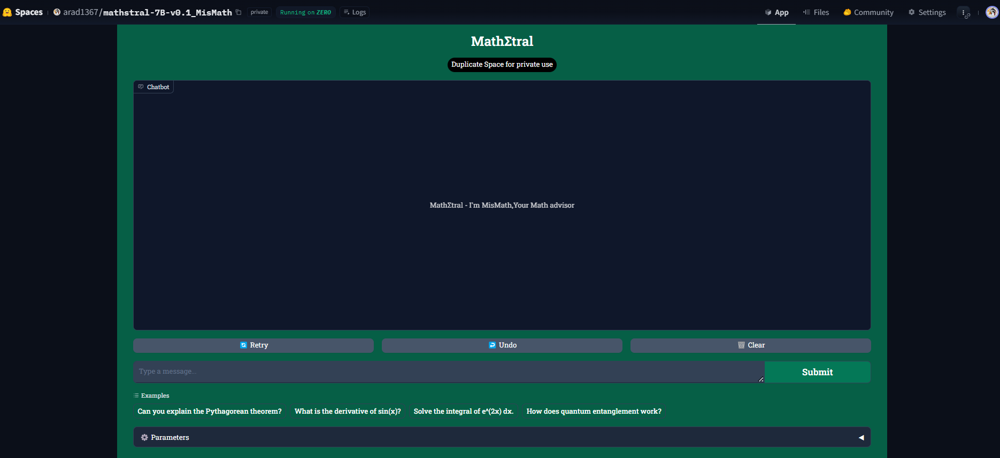

# MisMath (MathΣtral) - Your Math Advisor

 

MathΣtral is a math advisor application built using the **Mathstral 7B** model, based on the **Mistral 7B** architecture. This model specializes in handling mathematical and scientific queries, providing accurate and helpful responses.

## Features

- **Math Assistance**: Answer complex mathematical and scientific questions.
- **Interactive Chat Interface**: Powered by [Gradio](https://gradio.app/).
- **Customizable Parameters**: Adjust settings for temperature, token limit, and more.

## Setup locally - need a GPU

1. **Clone the Repository:**
   `git clone https://github.com/arad1367/Mathstral-7B-v0.1-Math-tral.git`
   `cd Mathstral-7B-v0.1-Math-tral`

2. Install Dependencies:
* Ensure you have Python 3.7+ and install the required libraries:
`pip install -r requirements.txt`

3. Run the Application:
`python app.py`

## Setup - Hugging face
* Just upload app.py and requirements.txt in your space and use it!
* Make sure you have access to GPU in Hugging Face

## Links
* Links to app: https://huggingface.co/spaces/arad1367/mathstral-7B-v0.1_MisMath
 

* Mathstral 7B Model on Hugging Face: https://huggingface.co/mistralai/Mistral-7B-v0.1
* Make sure you have access to model (permission is needed)

## Contact
* Pejman Ebrahimi, email: `pejman.ebrahimi77@gmail.com`
* website: `https://giltech-megoldasok.com/` & `https://arad1367.pythonanywhere.com/home`
* My space in Hugging face: `https://huggingface.co/arad1367`